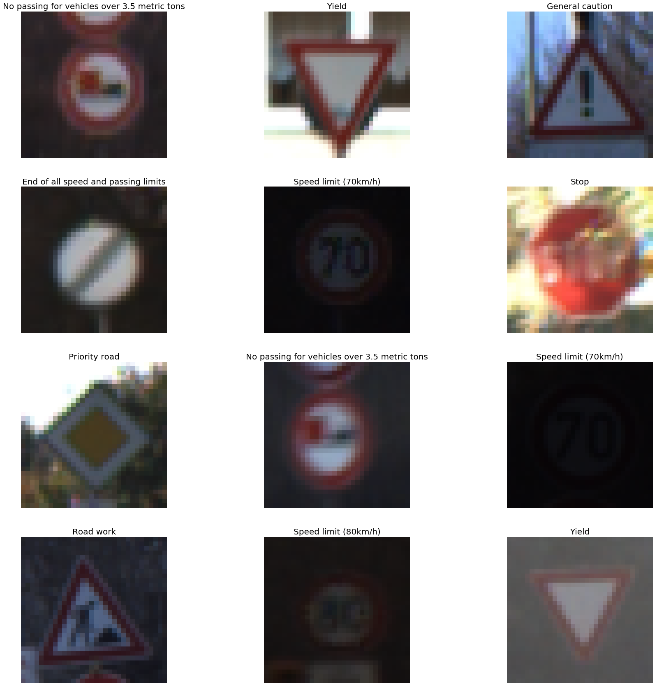
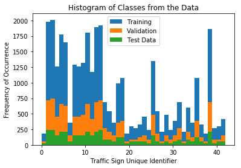
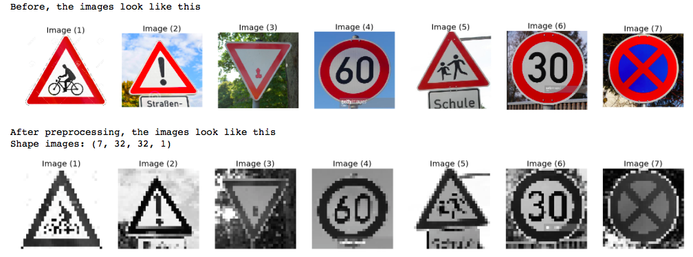

# **Traffic Sign Recognition** 

## Writeup Template

---

**Build a Traffic Sign Recognition Project**

The goals / steps of this project are the following:
* Load the data set (see below for links to the project data set)
* Explore, summarize and visualize the data set
* Design, train and test a model architecture
* Use the model to make predictions on new images
* Analyze the softmax probabilities of the new images
* Summarize the results with a written report


[//]: # (Image References)

[image1]: ./examples/visualization.jpg "Visualization"
[image2]: ./examples/grayscale.jpg "Grayscaling"
[image3]: ./examples/random_noise.jpg "Random Noise"
[image4]: ./examples/placeholder.png "Traffic Sign 1"
[image5]: ./examples/placeholder.png "Traffic Sign 2"
[image6]: ./examples/placeholder.png "Traffic Sign 3"
[image7]: ./examples/placeholder.png "Traffic Sign 4"
[image8]: ./examples/placeholder.png "Traffic Sign 5"

## Rubric Points
#### I will consider the [rubric points](https://review.udacity.com/#!/rubrics/481/view) individually and describe how I addressed each point in my implementation.  Here is a link to my [project code](https://github.com/udacity/CarND-Traffic-Sign-Classifier-Project/blob/master/Traffic_Sign_Classifier.ipynb)

###Data Set Summary & Exploration

#### 1. A basic summary of the data set. In the code, the analysis should be done using python, numpy and/or pandas methods rather than hardcoding results manually.

I just used numpy's default library to calculate summary statistics of the traffic
signs data set. Based on the code that I had written in the second cell, the statistics are as follows:

```
Number of training examples = 34799
Number of training examples = 4410
Number of testing examples = 12630
Image data shape = (32, 32, 3)
Number of classes = 43
```

#### 2. Exploratory visualization of the dataset.

Here is an exploratory visualization of the data set. I modified a [stackoverflow](https://stackoverflow.com/questions/35692507/plot-several-image-files-in-matplotlib-subplots) response to write a generalized `show_image` function. 



In addition, I thought it would be useful to take a look at the distribution of the classes.



###Design and Test a Model Architecture

####1. Describe how you preprocessed the image data. What techniques were chosen and why did you choose these techniques? Consider including images showing the output of each preprocessing technique. Pre-processing refers to techniques such as converting to grayscale, normalization, etc. (OPTIONAL: As described in the "Stand Out Suggestions" part of the rubric, if you generated additional data for training, describe why you decided to generate additional data, how you generated the data, and provide example images of the additional data. Then describe the characteristics of the augmented training set like number of images in the set, number of images for each class, etc.)

Prior to processing, I converted the image into grayscale.



Then, I normalized to be between -1 and 1 by subtracting 128 (the center of the range between 0 and 256) and then dividing by 128.

To augment the data, I could add aspect slight ratio changes or other rotation and translation transformations. I could also add speckle noise.


####2. Describe what your final model architecture looks like including model type, layers, layer sizes, connectivity, etc.) Consider including a diagram and/or table describing the final model.

My final model consisted of the following layers:

| Layer         		|     Description	        					| 
|:---------------------:|:---------------------------------------------:| 
| Input         		| 32x32x3 RGB image | 
| Convolution 5x5     	| 1x1 stride, valid padding, outputs 28x28x6 |
| RELU					|						|
| Max pooling	      	| 2x2 stride,  outputs 14x14x6 |
| Convolution 5x5	    | 1x1 stride, valid padding, output 10x10x16    |
| RELU					|						|
| Max pooling	      	| 2x2 stride,  outputs 14x14x6 |
| Fully connected		|  Outputs 120 flat neurons|
| RELU					|						|
| Dropout					|	Rate at 0.5 |
| Fully connected		|  Outputs 84 flat neurons|
| RELU					|						|
| Fully connected		|  Outputs 43 flat neurons|
| Softmax				| Outputs labels (43) One Hot|
 


####3. Describe how you trained your model. The discussion can include the type of optimizer, the batch size, number of epochs and any hyperparameters such as learning rate.

To train the model, I used a network very similar to LeNet. I used the cross entropy cost function with the Adam Optimizer, using a learning rate of 0.0009, and I ran it for 101 epochs, using batch sizes of 128. 

I also made sure to create a `saver` tensorflow variable, which loaded and saved models so I didn't have to start from scratch.

####4. Describe the approach taken for finding a solution and getting the validation set accuracy to be at least 0.93. Include in the discussion the results on the training, validation and test sets and where in the code these were calculated. Your approach may have been an iterative process, in which case, outline the steps you took to get to the final solution and why you chose those steps. Perhaps your solution involved an already well known implementation or architecture. In this case, discuss why you think the architecture is suitable for the current problem.

My final model results were conducted, and yielded the following:

```
Loaded models from model/lenet
Training...

EPOCH 1 ...
Training Accuracy = 1.000
Validation Accuracy = 0.962
Testing Accuracy = 0.940
```

I tried a bunch of architectures, and tried to implement InceptionNet layers. It took me a long time to get the dimensions right, but in the end the validation errors weren't getting what I wanted.

So, I went back to the original LeNet architecture (and very little has changed). Using LeNet, it worked very well, and so I just ended up going with this. It looks like there might be a bit of overfitting, but it seems to be doing okay otherwise.

I actually added dropout because I wanted to try it out; it seemed to do okay, and I could remedy the above problems with adding more. In terms of tuned parameters, I didn't play too much with the architecture. That is, I didn't adjust the maps too much, nor did I make too many hidden layers large.
 

###Test a Model on New Images

####1. Choose five German traffic signs found on the web and provide them in the report. For each image, discuss what quality or qualities might be difficult to classify.

Here are five German traffic signs that I found on the web:


I had to recrop all of these so that they are more or less squares because the aspect ratio would be off otherwise. These are stored in the `test-images/cropped` directory, and were the actual images that I used. 

While not all German signs were included in the training dataset, I didn't take that into account when Googling, assuming the most common images would be in the training set. As it turns out, the above right-most sign, a circle with an "X" on it was not in the set of all classes (seen below). Neither was the "school" sign. 


After I realized this, I ended up just using the following.


The predictions then became as follows:


####2. Discuss the model's predictions on these new traffic signs and compare the results to predicting on the test set. At a minimum, discuss what the predictions were, the accuracy on these new predictions, and compare the accuracy to the accuracy on the test set (OPTIONAL: Discuss the results in more detail as described in the "Stand Out Suggestions" part of the rubric).

Here are the results of the prediction:

| Image			        |     Prediction	        					| 
|:---------------------:|:---------------------------------------------:| 
| General Caution      		| General Caution   									| 
| Yield     			| Yield										|
| 60 km/h					| 60 km/h											|
| Priority Road 	      		| Priority Road					 				|
| 30 km/h 			| 30 km/h      							|


The model was able to correctly guess all of the signs, which is consistent with the test set. I did not find harder images, but I would expect the accuracy to be close to 90%.

####3. Describe how certain the model is when predicting on each of the five new images by looking at the softmax probabilities for each prediction. Provide the top 5 softmax probabilities for each image along with the sign type of each probability. (OPTIONAL: as described in the "Stand Out Suggestions" part of the rubric, visualizations can also be provided such as bar charts)

The softmax has high confidence on all of the images.


The graph shows all the confidence, and in reality, the precision is preetty close to 100%.

### Visualizing the Neural Network (See Step 4 of the Ipython notebook for more details)


From the activations, it looks like there are several patterns. The image shown is a caution sign, a triangle. It seems like there are patterns related to the edges. Also, not only that, the types of edges light up especially bright in some cases. For example, left and right are often different activations.


